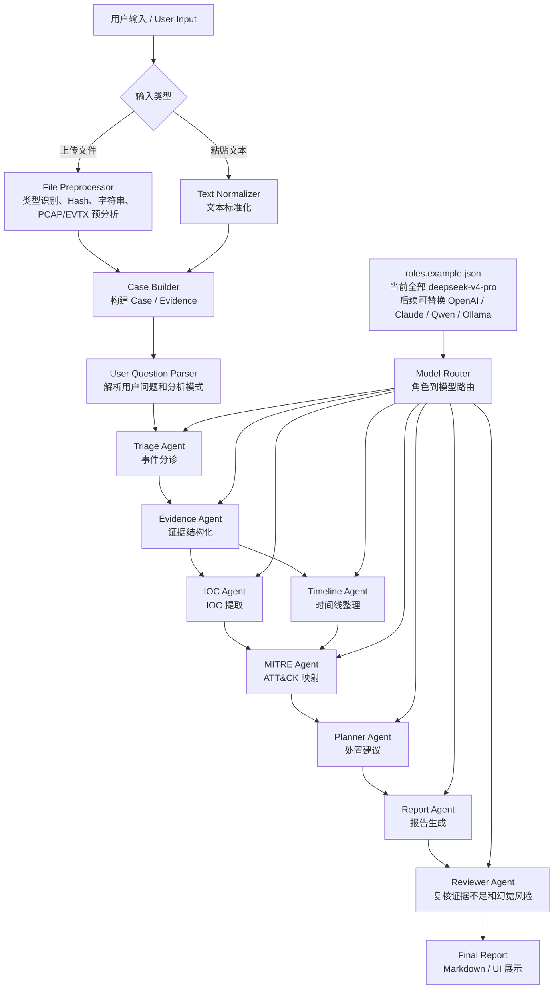

# BlueIR-Agent v4 工作流

## v4 角色

- `triage`：事件分诊
- `evidence`：证据结构化
- `ioc`：IOC 提取与归纳
- `timeline`：时间线整理和复核
- `mitre`：ATT&CK 映射
- `planner`：处置建议
- `report`：报告组织
- `reviewer`：证据缺口和幻觉风险复核

当前所有角色默认使用 `deepseek/deepseek-v4-pro`。后续接入其他模型时，优先修改 `configs/roles.example.json` 或新增 provider adapter。
